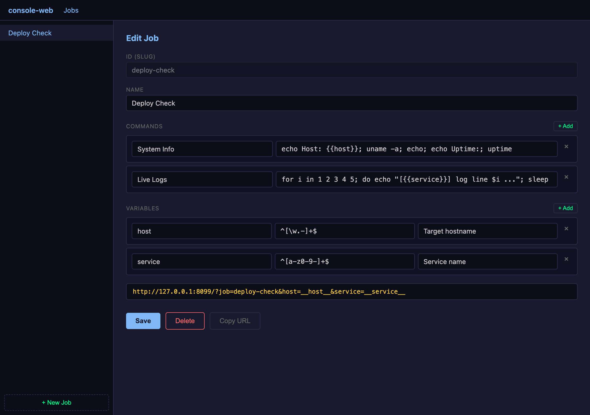
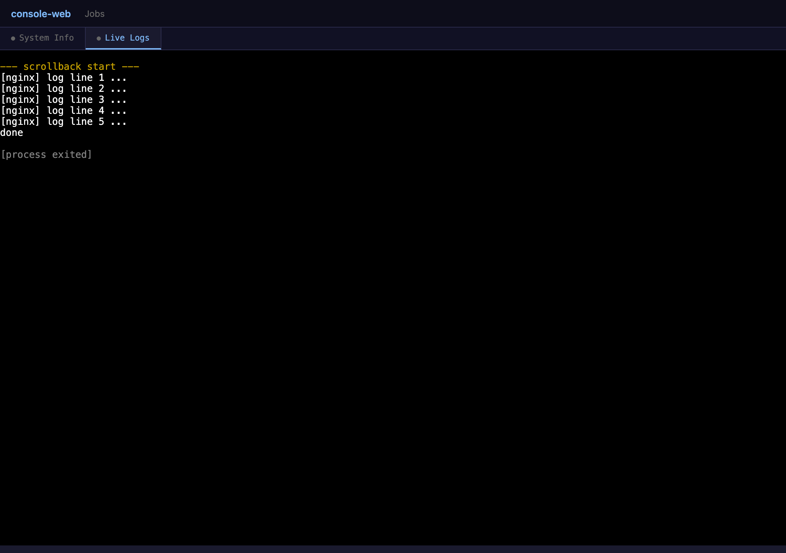

# console-web

A personal, web-based terminal emulator. You define named **jobs** — sets of
command templates with typed variables — and launch them by visiting a URL. The
server opens one browser terminal tab per command, runs each command in a real
PTY, and keeps the processes alive across browser refreshes and reconnects.

Single binary. No external services. No authentication. Built for one person on
localhost.

```
/?job=deploy-check&host=myserver.local&service=nginx
        │            │                  │
        │            └──────────────────┴─ variables (validated, substituted)
        └─ job id
```

---

## Features

- **Jobs as URLs** — encode a multi-command workflow in a single link with
  variable values as query parameters.
- **Real PTYs** — each command runs under `bash -c` in a pseudo-terminal, so
  interactive programs, colors, and TUIs work as expected.
- **Persistent sessions** — PTY processes survive browser close/refresh.
  Reconnecting reattaches to the live process and replays scrollback.
- **Scrollback on disk** — every pane's output is appended to a file and replayed
  to new clients, then trimmed to a configurable size cap.
- **Multi-client** — multiple browsers can attach to the same pane; output is
  broadcast to all and input from any is forwarded to the PTY.
- **Server-side variable validation** — each variable has a regex; raw values
  never reach the shell, only the fully substituted command does.
- **Browser-based job editor** — create and edit jobs at `/jobs`.
- **Self-contained binary** — the frontend (a statically-exported Next.js app,
  including xterm.js) is embedded via `go:embed`, and SQLite is pure Go
  (`modernc.org/sqlite`), so the result is a single CGO-free binary. Building it
  from source requires a one-time Node step to produce the static export.

---

## Screenshots

**Browser-based job editor** (`/jobs`) — define commands and typed variables,
then copy the launch URL:



**Live session** — one xterm.js tab per command, running in a real PTY with
scrollback replayed on reconnect:



---

## Quick start

Requires Go 1.26.4+ (the version pinned in `go.mod`) and Node.js 20.9+ (Node 22
recommended) to build the embedded frontend. PTY support is Unix-only — macOS and
Linux are supported; Windows is not.

```sh
git clone https://github.com/jbatesy/console-web.git
cd console-web
make build      # builds the Next.js static export, then the Go binary
./console-web
```

Then open <http://127.0.0.1:8080>. Visit `/jobs` to create your first job.

`make build` runs `npm ci && npm run build` in `frontend/` to produce the static
export at `frontend/out/` (which `go:embed` bundles into the binary), then runs
`go build`. Once the export exists, plain `go run .` / `go build .` also work; run
`make frontend` to rebuild the UI after frontend changes.

> **Note:** `frontend/out/` is gitignored, so a bare `go build` in a fresh
> checkout will fail until the frontend has been built. Use `make build` (or run
> the `npm` build first).

---

## Usage

### 1. Define a job

Go to `/jobs` and create a job, or `POST` one to the API:

```json
{
  "id": "deploy-check",
  "name": "Deploy Check",
  "commands": [
    { "label": "Status", "template": "curl -s {{host}}/status" },
    { "label": "Logs",   "template": "ssh {{host}} tail -f /var/log/{{service}}.log" }
  ],
  "variables": [
    { "name": "host",    "regex": "^[\\w.-]+$",   "description": "Target hostname" },
    { "name": "service", "regex": "^[a-z0-9-]+$", "description": "Service name" }
  ]
}
```

- `id` is a URL-safe slug used in `?job=<id>`.
- Each entry in `commands` becomes one terminal tab. `{{name}}` placeholders are
  substituted server-side.
- `variables` lists every placeholder used across the job's templates, each with
  its own validation `regex` (a Go `regexp` pattern; the value must fully match).

### 2. Launch it

Visit:

```
/?job=deploy-check&host=myserver.local&service=nginx
```

The server:

1. Looks up the job (404 if missing).
2. Validates each variable value against its regex. Any failure renders an HTML
   page listing which variables failed and the patterns they were expected to
   match.
3. Creates a session and one pane per command, substitutes variables, and spawns
   a PTY per pane.
4. Redirects to `/#session=<session-id>`.

The frontend reads the session id from the URL fragment, fetches the pane list,
and opens an xterm.js terminal per pane wired to a WebSocket.

### 3. Reconnect

The session id lives in the URL fragment. Reload the page (or open the same
`/#session=<id>` link elsewhere) to reattach to the running processes — the
server replays each pane's scrollback, then resumes live output. Panes whose
process has exited show an "exited" notification instead of a live terminal.

---

## Configuration

Configured entirely via CLI flags — no config file, no environment variables.

| Flag          | Default              | Description                                   |
|---------------|----------------------|-----------------------------------------------|
| `-addr`       | `127.0.0.1:8080`     | Listen address                                |
| `-db`         | `./console-web.db`   | SQLite database file path                     |
| `-data`       | `./data`             | Directory for pane scrollback files           |
| `-scrollback` | `10485760` (10 MB)   | Max scrollback bytes per pane before trimming |

When a pane's scrollback file exceeds `-scrollback`, the manager keeps the most
recent half and discards the rest, bounding disk usage.

> **Security note:** There is no authentication. Anyone who can reach the listen
> address can launch jobs and run commands on the host machine. Keep `-addr`
> bound to `127.0.0.1` (the default) unless you fully control network access.

---

## HTTP & WebSocket API

```
GET  /                     Launch a job when ?job=<id> is present (validate, create
                           session, redirect to /#session=<id>); otherwise serve the app shell
GET  /jobs                 Job editor page

GET    /api/jobs           List all jobs
POST   /api/jobs           Create a job (body: Job JSON; id required)
GET    /api/jobs/{id}      Get a job
PUT    /api/jobs/{id}      Update a job
DELETE /api/jobs/{id}      Delete a job (409 if it still has sessions)

GET  /api/sessions/{id}    Get a session and its pane list

WS   /ws/pane/{id}         Bidirectional terminal I/O for a pane
```

**WebSocket framing** — a single connection carries two frame types:

- **Binary** — raw PTY bytes. Client→server is keystrokes; server→client is
  terminal output.
- **Text** — JSON control messages, e.g. `{"type":"resize","cols":220,"rows":50}`.
  The server emits `{"type":"exited"}` when the pane's process ends.

On connect, the server first streams the pane's scrollback as binary frames
(prefixed with a `--- scrollback start ---` sentinel), then switches to live
output.

---

## Architecture

```
console-web/
  main.go                 flag parsing, server startup, static-file fallthrough
  internal/
    db/        store.go    SQLite schema + job/session/pane persistence
    pty/       manager.go  spawn bash -c PTYs, broadcast to N clients, scrollback files
    session/   manager.go  create sessions, spawn panes, reconnect/alive sync
    validate/  vars.go     per-variable regex validation + {{var}} substitution
    api/       handlers.go HTTP handlers (jobs REST, job launch, sessions)
               ws.go       WebSocket ↔ PTY bridge
  frontend/                Next.js app (TypeScript + Tailwind), statically exported
    app/page.tsx           tabbed terminal app shell (/)
    app/jobs/page.tsx      job editor (/jobs)
    components/            TerminalPane (xterm.js + WebSocket), Nav
    lib/                   typed API client, types, session/backend helpers
    out/                   `next build` output, embedded via go:embed (gitignored)
  Makefile                 frontend + Go build/test targets
```

**Data model:**

- **Job** — `id`, `name`, ordered `commands` (`label` + `template`), and
  `variables` (`name` + `regex` + `description`). Stored in SQLite with
  `commands`/`variables` as JSON columns.
- **Session** — created per launch: `id`, `job_id`, resolved `vars`,
  `created_at`. Never auto-deleted.
- **Pane** — one per command: `id`, `session_id`, `cmd_index`, `pid`, `alive`,
  `output_path`. `alive` flips to false when the PTY exits.

**Request flow on launch:** validate vars → create session row → create N pane
rows → substitute `{{vars}}` → spawn one `bash -c` PTY per pane → redirect to the
session fragment. The PTY manager owns running processes in memory and reconciles
`alive` status back into SQLite on reconnect.

The HTTP layer composes an API `ServeMux` with a static file server over the
embedded Next.js export (`frontend/out`): API routes, `/ws/*`, and `GET /?job=`
are handled by the mux; bare `GET /` serves `index.html`, `GET /jobs[/]` serves
`jobs/index.html`, and everything else (hashed `/_next/*` assets, etc.) is served
from the export.

---

## Development

See [CONTRIBUTIONS.md](CONTRIBUTIONS.md) for how to set up, test, and contribute.

```sh
make frontend                    # build the embedded static export (needed once)
make test                        # go test -race ./... (ensures the export exists)
gofmt -l $(git ls-files '*.go')  # list unformatted files (should print nothing)
go vet ./...
```

For live frontend work, run the Go backend and the Next.js dev server together:

```sh
go run .       # backend (API/WS/PTY) on :8080
make dev       # Next.js dev server on :3000, proxying /api and /ws to :8080
```

---

## TODO

Not yet supported:

- Authentication or access control.
- Remote execution — commands always run on the host running the server.
- Windows support (the PTY dependency is Unix-only).
